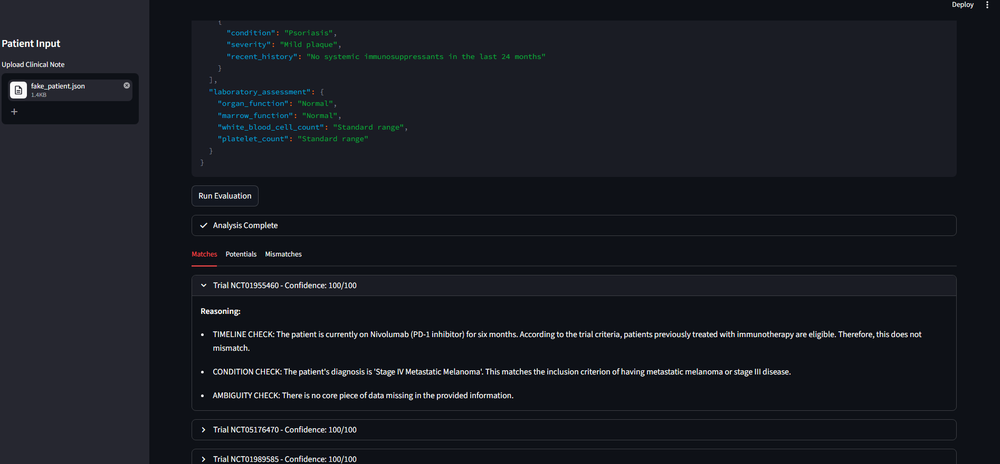

# Clinical Trial Eligibility Engine

This project is a clinical trial matching system designed to screen unstructured patient notes against complex eligibility protocols. It uses a specialized reasoning extraction pipeline to ensure that medical decisions are based on logic rather than simple keyword matching.

The system is built to run entirely on local hardware. This ensures that sensitive patient information remains private and never leaves the local infrastructure.



## Architecture

The core of this application is a two stage agentic pipeline. This design prevents the common issue of large language models hallucinating facts to fit a specific data format.

1. **The Reasoning Stage:** A non chat model (Mistral NeMo 12B) acts as a Senior Clinical Auditor. It performs a raw logic audit of the patient note against the trial criteria. It focuses on timeline conflicts, condition matches, and data gaps.
2. **The Extraction Stage:** A separate chat model acts as a Clerk. It reads the raw audit and maps the findings into a structured Pydantic schema. This ensures the final output is clean and usable for the interface without compromising the integrity of the medical reasoning.

## Project Structure

* **app.py:** The Streamlit interface that handles the user experience and result visualization.
* **scripts/ingest.py:** A data engineering script that processes trial protocols into a searchable vector database.
* **src/engine.py:** The core logic module containing the Pydantic schemas and the two stage inference pipeline.
* **assets/:** Local storage for trial protocols and sample patient data.
* **clinical_trial_index/:** The persistent local vector database.

## Prerequisites

You need to have Python 3.10 or higher installed. You also need to install Ollama to handle the local model inference.

1. Download and install Ollama.
2. Pull the required model by running the following command in your terminal:
   `ollama pull mistral-nemo`

## Setup and Installation

First, clone this repository to your local machine. Then, create a virtual environment and install the required packages.

```bash
pip install -r requirements.txt
```

Before running the application, you must build the vector database. Run the ingestion script once to process the clinical trials.

```bash
python scripts/ingest.py
```

## How to Run

Once the ingestion is complete, you can launch the Streamlit application.

```bash
streamlit run app.py
```

## Key Features

* **Truth First Logic:** The system is instructed to prioritize clinical contradictions. If a rule says no prior treatment and the patient is currently on medication, it flags a definite mismatch.
* **Data Gap Identification:** Instead of guessing, the engine identifies missing information. It generates specific questions for the doctor to answer to move a potential match forward.
* **Local Inference:** The system is optimized for high performance GPUs like the NVIDIA 3090 Ti. It uses local embeddings and models to maintain total data sovereignty.
* **Result Caching:** The application uses intelligent caching. This means that reevaluating the same patient note is instantaneous and saves significant computational resources.
